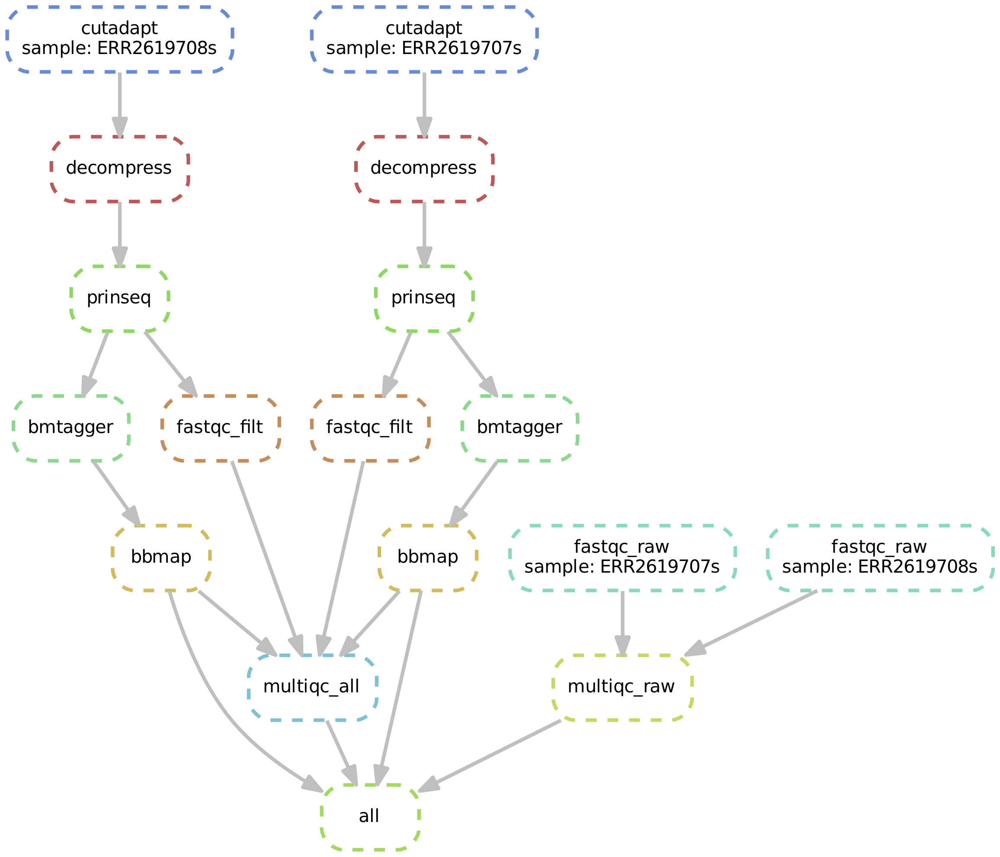

# metqc

Bioinformatics pipeline for performing QC on shotgun metagenomic data.

## Overview

This pipeline is written in snakemake and designed to automate and control the submission of processes to the Synergy server at the University of Calgary. Developed by Alana Schick for the lab of Dr. Laura Sycuro. 

Input: raw paired-end fastq files.

Output: filtered and cleaned fastq files, ready to use for downstream analysis. The pipeline also produces html reports and stats of various QC steps. 

## Installation

To use this pipeline, navigate to your project directory and clone this repository into that directory using the following command:

```
git clone https://github.com/alanaschick/metqc.git metqc
```

Note: you need to have **conda** and **snakemake** installed in order to run this. To install conda, see the instructions [here](https://github.com/ucvm/synergy/wiki). 

To install snakemake using conda, run the following line:

```
conda install -c bioconda -c conda-forge snakemake
```

See the snakemake installation [webpage](https://snakemake.readthedocs.io/en/stable/getting_started/installation.html) for further details.

## Config file

All the parameters required to run this pipeline are specified in a config file, written in yaml. See/modify the provided example file with your custom parameters, called `config.yaml`. This is the only file that should be modified before running the pipeline. Make sure to follow the syntax in the example file in terms of when to use quotations around parameters.

## Raw data and list of files.

Specify the full path to the directory that contains your raw data files in the config file. You also need to have a list of sample names which contains the names of the samples to run the pipeline on, one sample per line. You can run this pipeline on any number or subset of your samples. Sample names should include everything up to the R1/R2 (or 1/2) part of the file names of the raw fastq files. See `metqc_files/list_files_example.txt` as an example. Specify the name of your list in the config file.

If there are many samples, it may be convenient to generate the list of files using the following command, replacing `R1_001.fastq.gz` with the general suffix of your files:

```
ls | grep R1_001.fastq.gz | sed 's/_R1_001.fastq.gz//' > list_files.txt
```

## Description of other parameters
| Parameter | Description |
| -------------- | --------------- |
| run_cutadapt | Whether or not run cutadapt, which removes adapters and performs quality trimming |
| fwd_adapter | Forward adapter sequence (3' adapter) |
| rev_adapter | Reverse adapter sequence (5' adapter) |
| q5end | Quality threshold to trim off the 5' end, using the same algorithm implemented by BWA |
| q3end | Quality threshold to trim off the 3' end, set to 0 to perform no quality trimming |
| bmfilter_ref | Index for bmfilter (part of bmtagger), should be a bitmask file, see [link](https://www.westgrid.ca/support/software/bmtagger) for more info |
| srprism_ref | Index for srprism (part of bmtagger), should be a reference.srprism prefix, see above link for more info |
| bbmap_ref | Name of reference fasta for bbmap to align reads |
| num_threads | Number of threads to use, should never be more than 56 on Synergy |

## Running the pipeline on Synergy

Test the pipeline by running `snakemake -np`. This command prints out the commands to be run without actually running them. 

To run the pipeline on the Synergy compute cluster, enter the following command from the project directory:

```
snakemake --cluster-config cluster.json --cluster 'bsub -n {cluster.n} -R {cluster.resources} -W {cluster.walllim} -We {cluster.time} -M {cluster.maxmem} -oo {cluster.output} -e {cluster.error}' --jobs 100 --use-conda
```
The above command submits jobs to Synergy, one for each sample and step of the QC pipeline. Note: the file `cluster.json` contains the parameters for the LSF job submission system that Synergy uses. In most cases, this file should not be modified.

## Results and log files

Snakemake will create a directory for the results of the pipeline as well as a directory for log files. Log files of each step of the pipeline will be written to the `logs` directory.

## Pipeline summary



### Steps

1) QC raw reads using fastqc and multiqc. This step generates an html file called `multiqc_report_raw.html` in the `results` directory.

2) Quality filtering and adapter trimming using cutadapt. This step is optional; to disable the pipeline from running cutadapt, set the parameter `run_cutadapt = FALSE` in the config file. If using cutadapt, specify the quality cutoff and adapter sequences to be trimmed in the config file. This step outputs trimmed sequence files to a directory called `data/trimdata/` and adds the suffix 'trim' to file names.

3) Dereplication and filtering of low complexity reads using PRINSEQ. This step outputs filtered sequence files to a directory called `data/filtdata/` and adds the suffix 'filtered' to file names.

4) QC on filtered reads using fastqc.

5) Remove human reads using BMtagger. Specify location of reference files to be used in config file (need to specify a .bitmask file and a .srprism prefix, see config file for example). This step outputs sequence files of non human reads only to a directory called `data/bmtagger/` with the suffix 'nohuman'. 

6) Map reads to human reference genome using BBMap. Specify location of reference file in config file (need to specify a fasta file). This step generates two fastq files for each sample: one of reads that mapped to the human genome and one reads that did not map to the human genome. Files are output to a directory called `data/bbmap/` with the suffix 'mapped' and 'unmapped'. 

7) Final QC step on all files using multiqc. This step generates an html file called `multiqc_report_all.html` in the `results` directory. 


