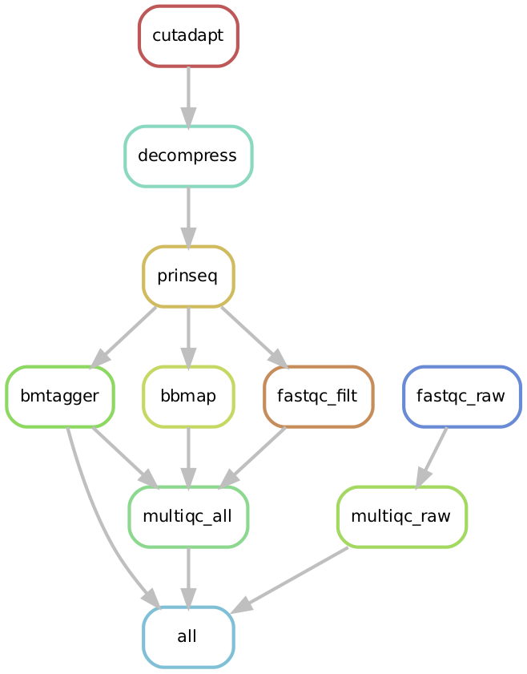

# metqc

Bioinformatics pipeline for performing QC on shotgun metagenomic data.

## Overview

Input: 

* Raw paired-end fastq files from shotgun metagenome sequencing. 

Output:

* Filtered and cleaned fastq files, ready to use for downstream analysis. 
* An html report of various QC steps from multiqc. 

## Pipeline Summary

Example workflow. Note that the `cutadapt` and `bbmap` steps are optional. See the description of parameters section for more information.



## Steps

NOTE: to disable all steps besides fastqc/multiqc, set the parameter `qc_only` to `TRUE`.

1) QC raw reads using fastqc and multiqc. This step generates an html file called `multiqc_report.html` in the `results` directory.

2) Adapter trimming using cutadapt. This step is optional; to disable set the parameter `run_cutadapt = FALSE` in the config file. If using cutadapt, specify the adapter sequences to be trimmed in the config file. This step outputs trimmed sequence files to a directory called `output/cutadapt/` and adds the suffix 'trimmed' to file names.

	Options:
	* `minlength`: reads shorter than this will be discarded (default: 60)
	* `maxn`: maximum number of N bases allowed (default: 10)

3) PRINSEQ - quality filtering, dereplication, and filtering of low complexity reads. This step outputs filtered sequence files to a directory called `output/prinseq/` and adds the suffix 'filtered' to file names.

	Options:
	* `trimleft`: trim from the 5' end (default: 0)
	* `trimright`: trim from the 3' end (default: 0)
	* `trim_qual_left`: trim sequence by quality score from the 5' end with this threshold score (default: 25)
	* `trim_qual_right`: trim sequence by quality score from the 3' end with this threshold score (default: 25)
	* `trim_qual_window`: size of sliding window used to calculate quality score (default: 10)
	* `trim_qual_step`: step size used to move the sliding window (default: 2)
	* `trim_qual_type`: type of quality score calculation to use (default: mean)
	* `trim_qual_rule`: rule to use to compare quality score to calculated value (default: lt)
	* `lc_method`: method to filter low complexity sequences (default: dust)
	* `lc_threshold`: value used to filter sequences by sequence complexity (default: 7)

4) QC on filtered reads using fastqc and multiqc. This step generates an html file called `multiqc_report_filtered.html` in the `results` directory.

5) Remove human reads using BMtagger. This step is optional; to disable set the parameter `run_bmtagger = FALSE` in the config file. If using, specify location of reference files to be used in config file (need to specify a .bitmask file and a .srprism prefix, see config file for example). This step outputs sequence files of non human reads only to a directory called `output/bmtagger/` with the suffix 'bmtagged'. 

6) Map reads to human reference genome using BBMap. This step is optional; to disable set the parameter `run_bbmap = FALSE` in the config file. If using,  specify location of reference file in config file (need to specify a `.fasta` file). This step generates two fastq files for each sample: one of reads that mapped to the human genome and one reads that did not map to the human genome. Files are output to a directory called `output/bbmap/` with the suffix 'bbmapped' and 'human_reads'. 

## Installation

To use this pipeline, navigate to your project directory and clone this repository into that directory using the following command:

```
git clone https://github.com/SycuroLab/metqc.git metqc
```

Note: you need to have **conda** and **snakemake** installed in order to run this. See instructions below. 

## Config file

All the parameters required to run this pipeline are specified in a config file, written in yaml. See/modify the provided example file with your custom parameters, called `config.yaml`. This is the only file that should be modified before running the pipeline. Make sure to follow the syntax in the example file in terms of when to use quotations around parameters.

## Raw data and list of files.

Specify the full path to the directory that contains your raw data files in the config file. You also need to have a list of sample names which contains the names of the samples to run the pipeline on, one sample per line. You can run this pipeline on any number or subset of your samples. Sample names should include everything up to the R1/R2 (or 1/2) part of the file names of the raw fastq files. See `metqc_files/list_files_example.txt` as an example. Specify the name of your list in the config file.

If there are many samples, it may be convenient to generate the list of files using the following command, replacing `R1_001.fastq` with the general suffix of your files:

```
ls | grep R1_001.fastq | sed 's/_R1_001.fastq//' > list_files.txt
```

## Description of parameters
| Parameter | Description | Example/Default |
| -------------- | --------------- | ------------ |
| list_files | Full path and name of your sample list. | `"/home/aschick/project/list_files.txt"` |
| path | Location of input files. | `"/home/aschick/project/data/filtered/"` |
| for | Suffix of forward reads. | `"_R1_001"` |
| rev | Suffix of reverse reads. | `"_R2_001"` |
| qc_only | Set to TRUE to only run fastqc and multiqc. | `FALSE` |

### Optional parameters
| Parameter | Description | Example/Default |
| -------------- | --------------- | ------------ |
| run_cutadapt | Whether or not run cutadapt to remove adapters | `FALSE` |
| fwd_adapter | Forward adapter sequence (3' adapter) | `CTGTCTCTTAT...` |
| rev_adapter | Reverse adapter sequence (5' adapter) | `CTGTCTCTTAT...` |
| minlength | Reads shorter than this will be discarded (if using cutadapt) | `60` | 
| maxn | Maximum number of N bases allowed, reads with more will be discarded | `10` |
| trimleft | Trim sequence from the 5'-end | `0` |
| trimright | Trim sequence from the 3'-end | `0` |
| trim_qual_left | Trim sequence by quality score from the 5' end with this threshold score | `25`|
| trim_qual_right | Trim sequence by quality score from the 3' end with this threshold score | `25`|
| trim_qual_window | The sliding window size used to calculate quality score by type | `10` |
| trim_qual_step | Step size used to move the sliding window | `2` | 
| trim_qual_rule | Rule to use to compare quality score to calculated value. Allowed options are lt (less than), gt (greater than, default) and et (equal to) | `"lt"` | 
| trim_qual_type | Type of quality score calculation to use, allowed options are: min, mean (default), max, sum | `"mean"` |
| run_bmtagger | Whether or not to run bmtagger | `TRUE` |
| bmfilter_ref | Index for bmfilter (part of bmtagger), should be a bitmask file, see [link](https://www.westgrid.ca/support/software/bmtagger) for more info | `"/home/refs/hg19/hg19_rRNA_reference.bitmask"` |
| srprism_ref | Index for srprism (part of bmtagger), should be a reference.srprism prefix, see above link for more info | `"/home/refs/hg19/hg19_rRNA_reference.srprism"` |
| run_bbmap | Whether or not to run bbmap | `FALSE` |
| bbmap_ref | Name of reference fasta for bbmap to align reads | `"/home/refs.hs37.fa"` |

## Running the pipeline on Synergy

Test the pipeline by running `snakemake -np`. This command prints out the commands to be run without actually running them. 

To run the pipeline on the Synergy compute cluster, enter the following command from the project directory:

```
snakemake --cluster-config cluster.json --cluster 'bsub -n {cluster.n} -R {cluster.resources} -W {cluster.walllim} -We {cluster.time} -M {cluster.maxmem} -oo {cluster.output} -e {cluster.error}' --jobs 500 --use-conda
```
The above command submits jobs to Synergy, one for each sample and step of the QC pipeline. Note: the file `cluster.json` contains the parameters for the LSF job submission system that Synergy uses. In most cases, this file should not be modified.

## Results and log files

Snakemake will create a directory for the results of the pipeline as well as a directory for log files. Log files of each step of the pipeline will be written to the `logs` directory.

## Conda and Snakemake

To install conda, see the instructions [here](https://github.com/ucvm/synergy/wiki). 

To install snakemake using conda, run the following line:

```
conda install -c bioconda -c conda-forge snakemake
```
See the snakemake installation [instructions](https://snakemake.readthedocs.io/en/stable/getting_started/installation.html) for further details.


